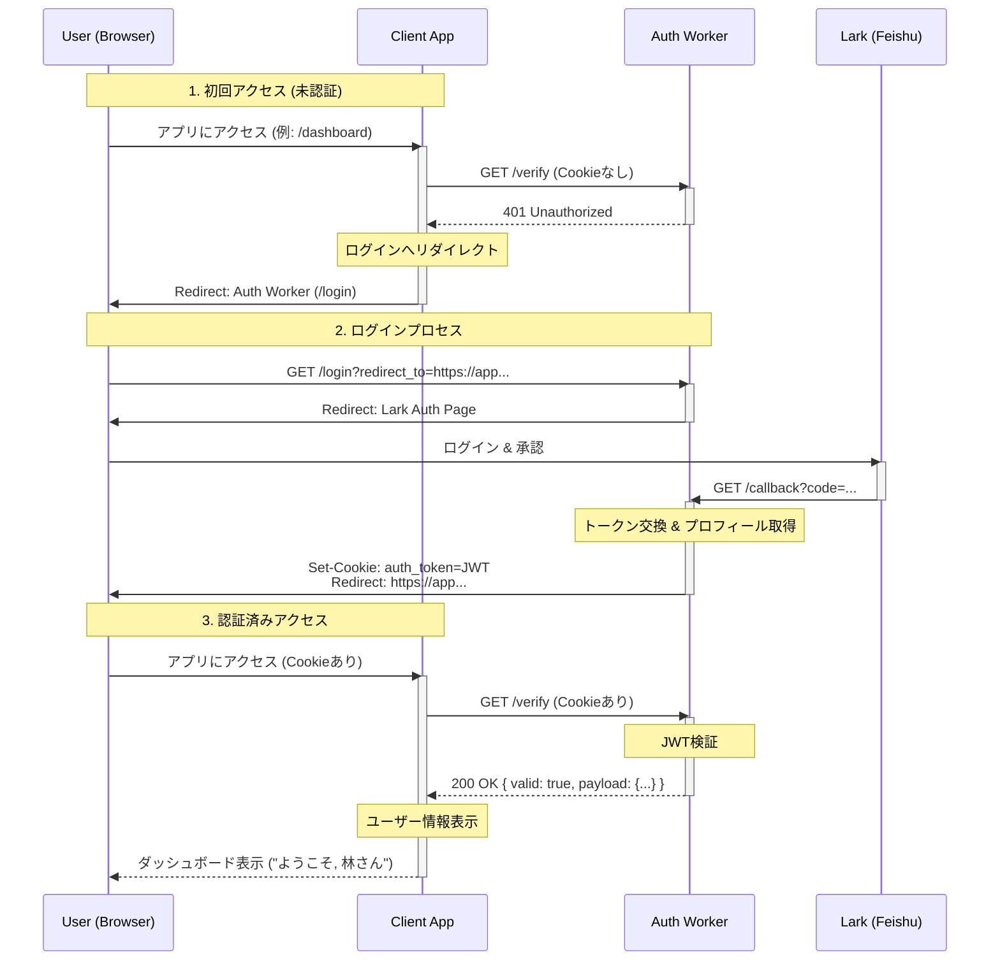

# Auth Worker API Documentation

Base URL: `https://auth.lodgegeek.com` (Production) / `http://localhost:8789` (Local)

## Overview

The Auth Worker provides a centralized authentication service using Lark (Feishu) OAuth. It issues a signed JWT in a HTTP-only cookie (`auth_token`) that is shared across `*.lodgegeek.com` subdomains.

## Endpoints

### 1. Login

Initiates the OAuth flow. Redirects the user to Lark's login page.

- **URL**: `/login`
- **Method**: `GET`
- **Query Parameters**:
  - `redirect_to` (Required): The URL to redirect the user to after successful login. Must be a valid URL ending with an allowed domain (configured in `ALLOWED_REDIRECT_DOMAINS`) or `localhost`.

- **Example**:

  ```http
  GET /login?redirect_to=https://app1.lodgegeek.com/dashboard
  ```

### 2. Callback

Handles the OAuth callback from Lark. **Do not call this endpoint directly.**

- **URL**: `/callback`
- **Method**: `GET`
- **Query Parameters**:
  - `code`: Authorization code from Lark.
  - `state`: Preserved state (contains the `redirect_to` URL).

- **Behavior**:
  1. Exchanges `code` for an access token.
  2. Retrieves user information from Lark.
  3. Generates a signed JWT containing user details.
  4. Sets the `auth_token` cookie (Domain: `.lodgegeek.com`).
  5. Redirects the user back to the `redirect_to` URL.

### 3. Logout

Logs the user out by clearing the authentication cookie.

- **URL**: `/logout`
- **Method**: `GET`

- **Example**:

  ```http
  GET /logout
  ```

### 4. Verify Token

Verifies the validity of the current authentication cookie. Useful for API-based validation or debugging.

- **URL**: `/verify`
- **Method**: `GET`
- **Headers**:
  - `Cookie`: Must contain `auth_token`.

- **Response**:
  - **Success (200 OK)**:

    ```json
    {
      "valid": true,
      "payload": {
        "sub": "ou_...",
        "name": "User Name",
        "email": "user@example.com",
        "exp": 1700000000,
        "iat": 1600000000
      }
    }
    ```

  - **Failure (401 Unauthorized)**:

    ```json
    {
      "valid": false,
      "error": "No token found" // or "Invalid token"
    }
    ```

## JWT Payload Structure

The JWT issued by this service contains the following standard claims:

| Claim | Description |
| :--- | :--- |
| `sub` | Lark User ID (Open ID or Union ID) |
| `name` | User's display name |
| `email` | User's email address (if available) |
| `iat` | Issued At timestamp |
| `exp` | Expiration timestamp (default: 7 days) |

## クライアントアプリケーション実装ガイド (AI指示用)

このセクションは、他のプロジェクト（クライアントアプリ）で本認証基盤を利用するための実装指示書です。
他のAIエージェントに改修を依頼する際は、以下の内容をプロンプトとして渡してください。

---

### 指示: 認証基盤 (Auth Worker) との連携実装

このアプリケーションに、中央集権型認証基盤 (`auth-worker`) を利用したSSO認証フローを実装してください。

#### 1. 前提条件
*   **認証基盤のURL**: `https://auth.lodgegeek.com` (本番) / `http://localhost:8789` (ローカル)
*   **認証方式**: HTTP-only Cookie (`auth_token`) によるJWT共有
*   **ドメイン要件**: アプリケーションは `*.lodgegeek.com` または `localhost` で動作する必要があります（Cookie共有のため）。

#### 2. 実装すべき認証フロー

アプリケーションのフロントエンド（またはBFF）で、以下のロジックを実装してください。

#### 認証フローのシーケンス図



#### 各ステップの実装詳細


1.  **初回ロード時の認証チェック (`/verify`)**
    *   アプリ起動時（または保護されたページへのアクセス時）に、Auth Workerの `/verify` エンドポイントを叩いて認証状態を確認する。
    *   **重要**: Cookieを送信するため、必ず `credentials: 'include'` オプションを付けること。
    *   **リクエスト例**:
        ```javascript
        const AUTH_BASE_URL = 'https://lark-auth-worker.edgeone.app'; // 環境変数化すること
        const res = await fetch(`${AUTH_BASE_URL}/verify`, {
            method: 'GET',
            credentials: 'include', // 必須: Cookieを送る
        });
        ```

2.  **未認証時のリダイレクト処理 (`/login`)**
    *   `/verify` が `401 Unauthorized` またはエラーを返した場合、ユーザーをログインページへリダイレクトする。
    *   `redirect_to` パラメータに、ログイン後に戻ってきたい自アプリのURLを指定する。
    *   **リダイレクト先URL例**:
        ```
        https://lark-auth-worker.edgeone.app/login?redirect_to=https://my-app.edgeone.app/dashboard
        ```

3.  **認証済みユーザー情報の利用**
    *   `/verify` が `200 OK` を返した場合、レスポンスボディ（JSON）からユーザー情報を取得し、アプリの状態（State/Store）に保存する。
    *   **レスポンス形式**:
        ```json
        {
          "valid": true,
          "payload": {
            "name": "林俊介",
            "email": "shunsuke.hayashi@lodgegeek.com",
            "avatar_url": "...",
            ...
          }
        }
        ```

4.  **ログアウト処理 (`/logout`)**
    *   ログアウトボタン押下時に、Auth Workerの `/logout` エンドポイントへリダイレクト（またはFetch）する。
    *   処理後、自アプリのトップページ等に戻るように実装する。

#### 3. 開発環境での注意点
*   ローカル開発 (`localhost`) でもCookieは共有されますが、ブラウザによっては `Third-party Cookie` の制限に引っかかる場合があります。開発中はブラウザの設定でサードパーティCookieを許可するか、同じ親ドメイン（hosts設定など）で動作させることを推奨します。

---
